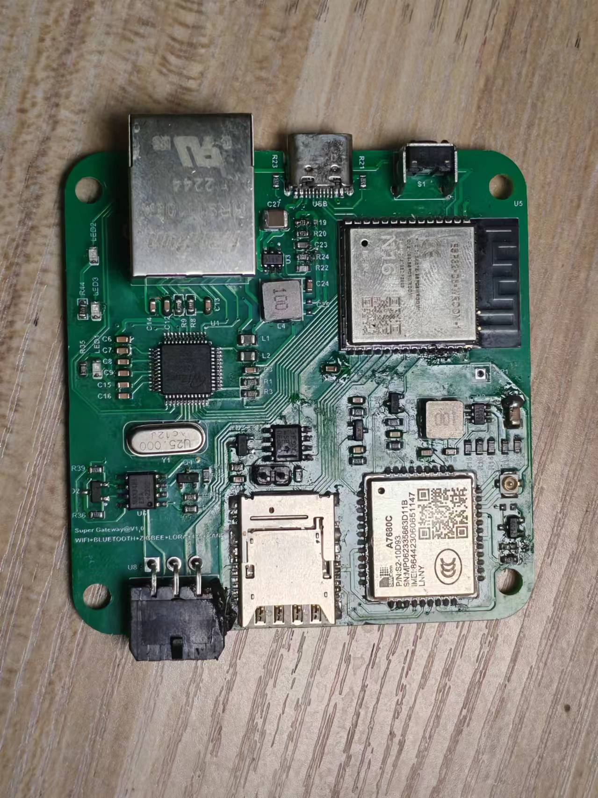
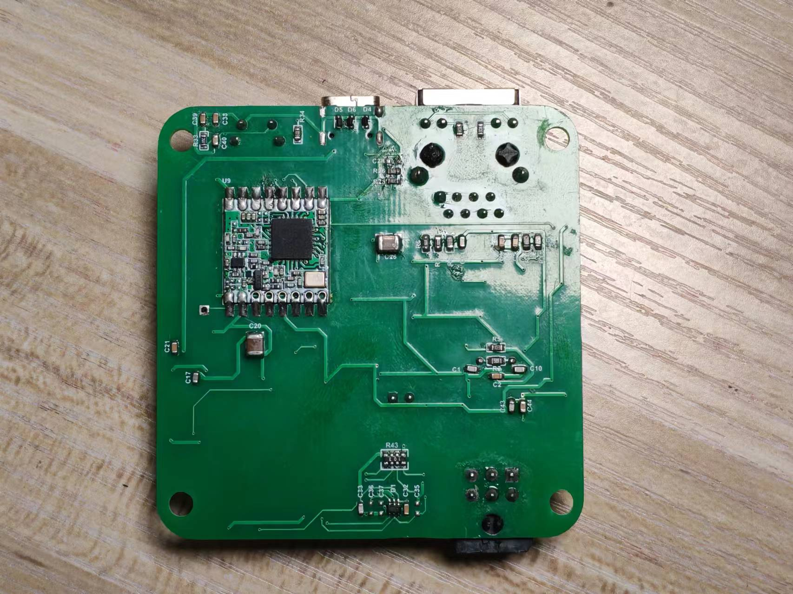
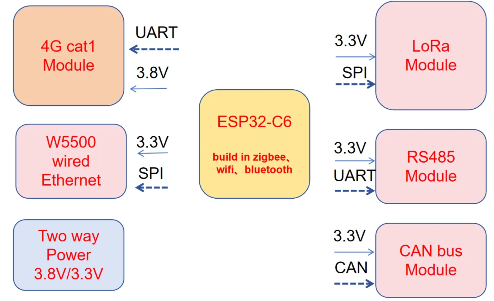
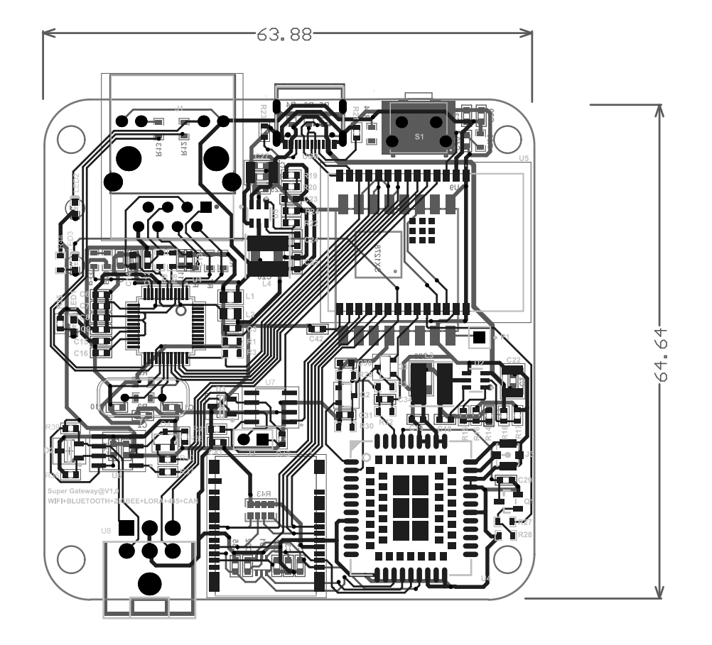
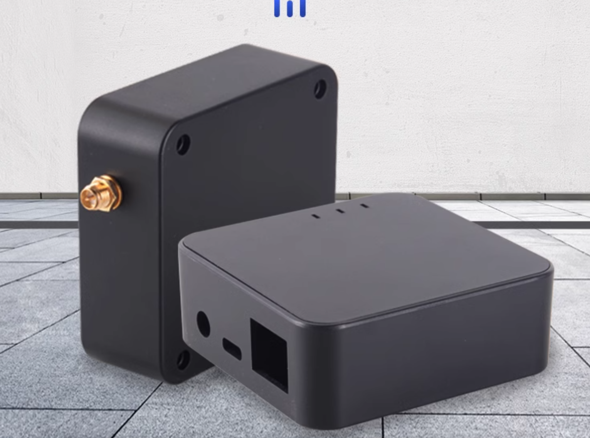

# superGateway 基于esp32-c6模组的超级网关

## 产品说明
> [!NOTE]
> 本网关融合了zigbee，wifi，bluetooth，wire ethernet，4g，Lora等多种丰富的通讯接口。
> 本网关可采集RS485总线，CAN总线的相关数据

本文文档位于 [这里](https://medium.com/@yongxiangliu/a-super-gateway-with-wired-ethernet-4g-lora-zigbee-rs485-can-bus-wifi-bluetooth-and-zigbee-c2f3361c1a2d)

## 通过本产品可以实现很多的转换，如

* zigbee转4g
* zigbee转wifi
* zigbee转蓝牙
* zigbee转RS485
* zigbee转CAN总线
* zigbee转Lora
* zigbee转以太网
* ------------------

* 有线以太网转4g
* 有线以太网转zigbee
* 有线以太网转wifi
* 有线以太网转蓝牙
* 有线以太网转RS485
* 有线以太网转CAN总线
* 有线以太网转Lora
* ------------------

* 4g转zigbee
* 4g转wifi
* 4g转蓝牙
* 4g转RS485
* 4g转CAN总线
* 4g转Lora
* 4g转以太网
* ------------------

* lora转zigbee
* lora转wifi
* lora转蓝牙
* lora转RS485
* lora转CAN总线
* lora转4g
* lora转以太网
* ------------------

* 蓝牙转zigbee
* 蓝牙转wifi
* 蓝牙转RS485
* 蓝牙转CAN总线
* 蓝牙转Lora
* ------------------

## Features
### 正面

### 背面

### 电路板框架

### 电路板尺寸64mm*64mm

### 本电路板适配的外壳

### 本项目采用的4G模组型号及对应差别

